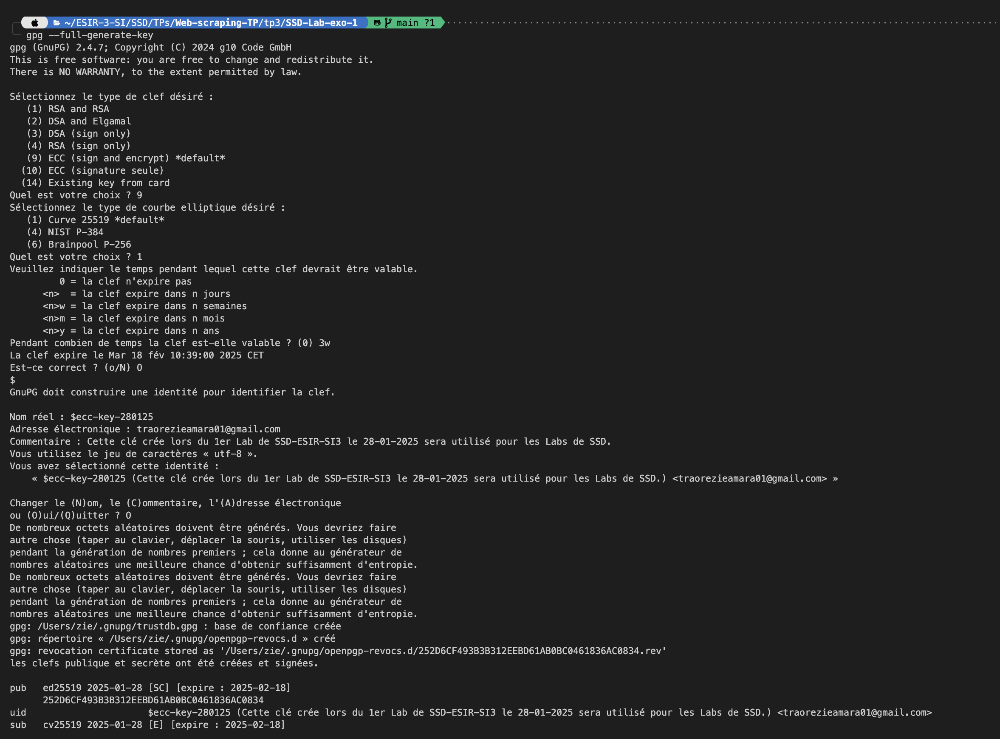
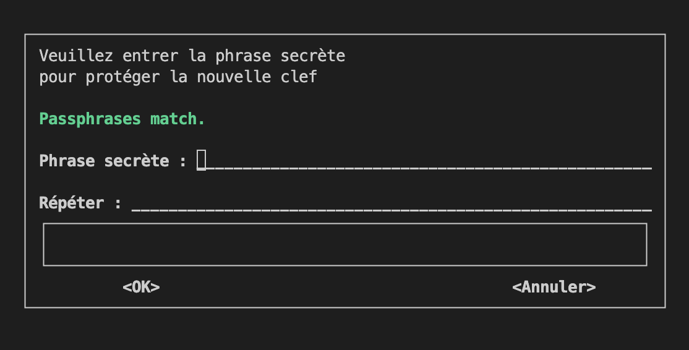
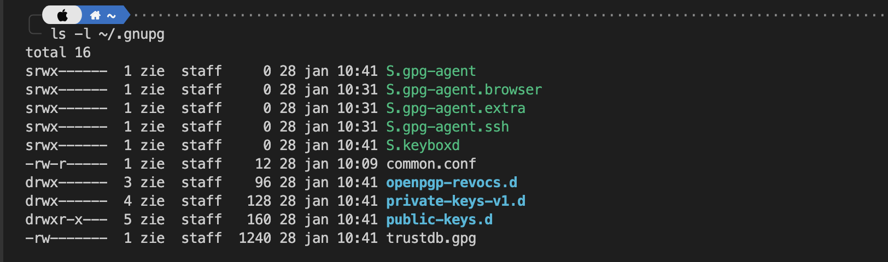

# Prise de Notes

## 1. The GNU Privacy Guard (GnuPG)

### 1.1. Installation

Installer *GnuPG* sur votre machine s'il n'est pas encore installé.

### 1.2. Génération de clé publique et privée

```bash
gpg --full-generate-key
```

Le flag `--full-generate-key` est utilisé pour générer une paire de clefs complètes.

La clé de signature ECC, ou Elliptic Curve Cryptography, est un algorithme de cryptographie à clé publique qui utilise les propriétés mathématiques des courbes elliptiques pour générer des systèmes cryptographiques. Elle permet de produire des clés de signature numériques plus courtes que celles de RSA tout en offrant une sécurité équivalente. Par exemple, une clé ECC de 256 bits offre la même sécurité qu’une clé RSA de 3072 bits.

Une des courbes elliptiques les plus connues utilisées pour la signature ECC est Curve25519, qui est en réalité une courbe elliptique conçue pour l’échange de clés Diffie-Hellman (DH).



Vivement_la_fin_du_semestre@




Why is it necessary to sign key?
> 

Can anyone create a key and pretend to be another person?
>

Can you think of a way to make sure that a given key really belongs to the person listed on the key?
>

What do you think are the benefits of signing keys?
>

### 1.3. Encrypt with GPG using public key

```bash
cat > tza-secret-message.txt <<EOF

This is a secret message
My name is "Zié TRAORÉ"
My credit card number is 4242 4242 4242 4242
The password is 123

EOF
```
